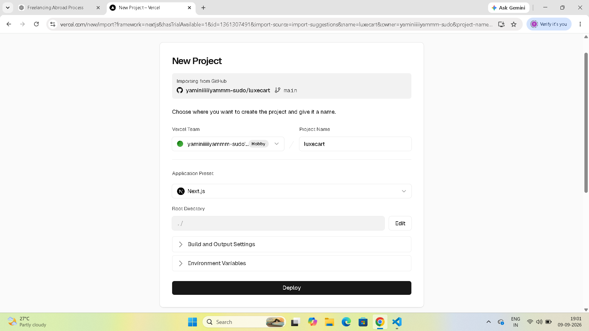
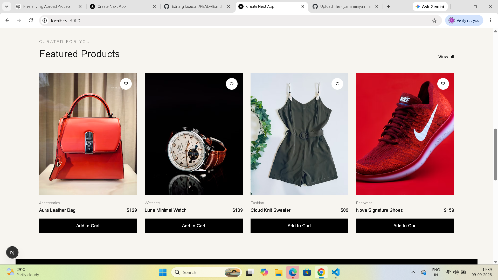

# LuxeCart 🛍️

A modern premium e-commerce website built with Next.js, React, TypeScript, and Tailwind CSS.

## 🚀 Live Demo

[View LuxeCart Live](https://luxecart-zeta.vercel.app/)
## 📸 Screenshot


## 📸 Screenshot



## ✨ Features

- Premium modern e-commerce design
- Responsive desktop and mobile layout
- Product showcase with images
- Product categories
- Add to Cart functionality
- Dynamic cart count
- Remove products from cart
- Dynamic cart total
- Checkout screen
- Order summary
- Interactive UI

## 🛠️ Tech Stack

- Next.js
- React
- TypeScript
- Tailwind CSS
- Git
- GitHub
- Vercel

## 💻 Run Locally

Clone the repository:

```bash
git clone https://github.com/yaminiiiiiyammm-sudo/luxecart.git
